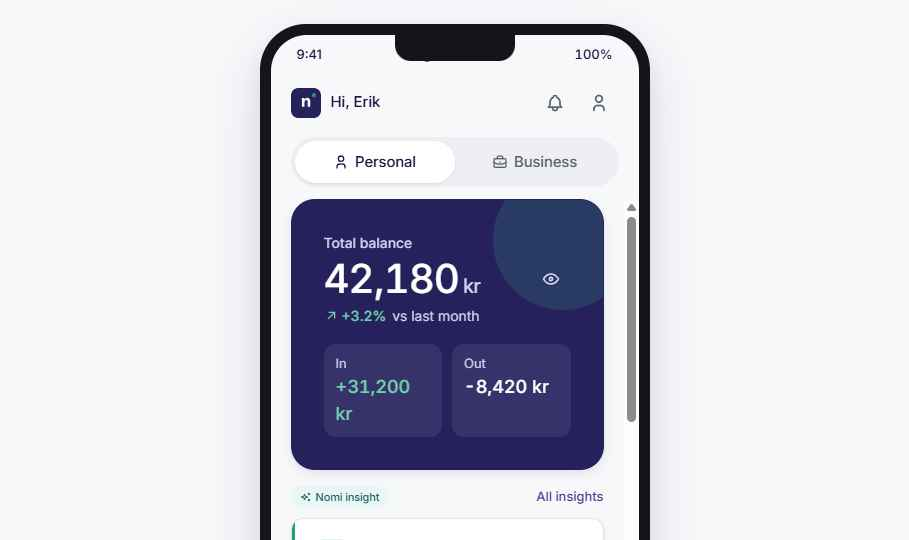
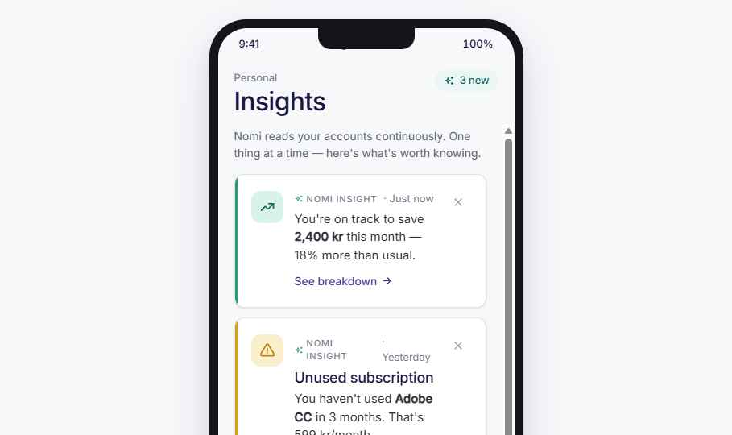
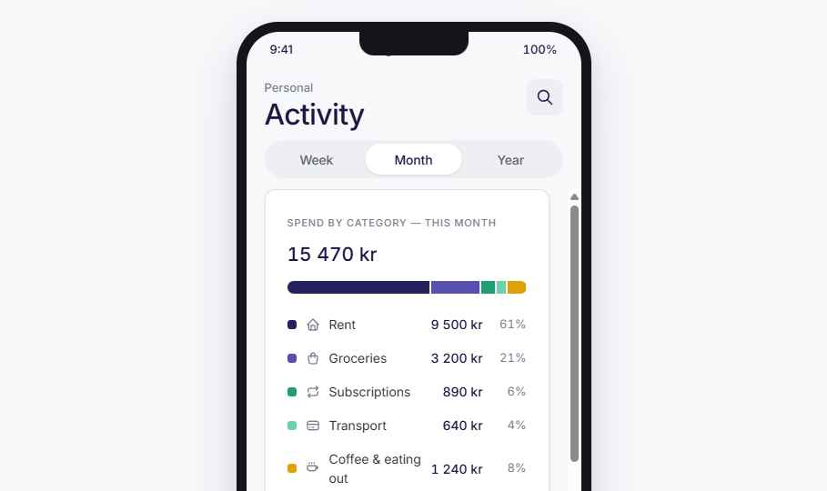
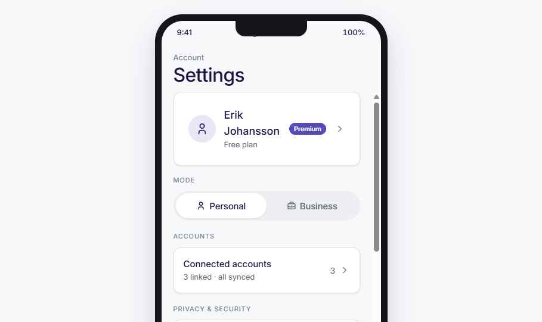
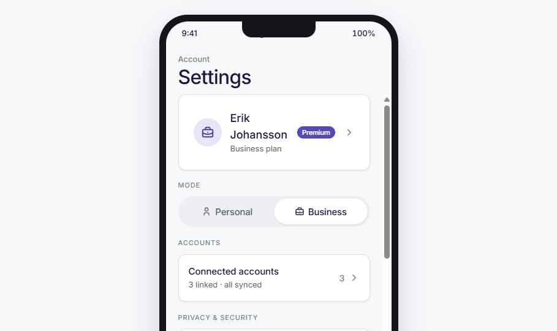

# Nomi — Mobile App Design Handoff

Personal & business finance app design system and interactive prototype, built around one core value: proactive, plain-language "insights" instead of raw dashboards.

## Screenshots

| Home (Personal) | Insights |
| --- | --- |
|  |  |

| Activity (Business) | Settings |
| --- | --- |
|  |  |

| Home (Business) |
| --- |
|  |

## Repository contents
```
design_handoff_nomi_app/
├── README.md              this file
├── LICENSE                replace with your org's actual license before publishing
├── .gitignore
├── screenshots/           PNG captures of key screens (above)
└── source/
    ├── ui_kits/mobile_app/  the interactive HTML/React prototype (open index.html in a browser)
    ├── tokens/              design tokens: colors, typography, spacing, radii, shadows, motion
    └── styles.css           global stylesheet entry point
```
Shared design-system components (Button, Input, Card, InsightCard, etc.) live in the parent
design-system project's `components/` folder and aren't duplicated here — see the Files section
below.

## How to view the prototype
The prototype is plain HTML + in-browser Babel/React — no build step required.
1. Open `source/ui_kits/mobile_app/index.html` directly in a browser (or serve the folder with
   any static file server, e.g. `npx serve source/ui_kits/mobile_app`).
2. Click through onboarding → register or sign in → the four tabs (Home, Insights, Activity,
   Settings) and their sheets.

## Overview
Nomi is a finance app with two modes — **Personal** and **Business** — built around one core value: proactive, plain-language "insights" instead of raw dashboards. This package covers the full interactive mobile-app prototype: onboarding, auth (register + sign in), the four main tabs (Home, Insights, Activity, Settings), and all supporting sheets/modals (transaction detail, premium upgrade, profile edit, insight actions).

## About the Design Files
The files in `source/` are **design references built in HTML/React (Babel, in-browser JSX)** — clickable prototypes showing intended look, content, and interaction, not production code to copy verbatim. The task is to **recreate these designs in the target codebase's real environment** (native iOS/Android, React Native, Flutter, etc. — whichever this product actually ships on) using that platform's idiomatic patterns, not by embedding this HTML. If no mobile stack exists yet, pick the most appropriate one for the team and implement the designs there.

## Fidelity
**High-fidelity.** Colors, type, spacing, copy, and states are final/near-final. Recreate pixel-for-pixel using the values in this document and in `source/tokens/`.

## Screens / Views

### 1. Intro (3 slides + "Meet Nomi" welcome)
- Full-bleed centered layout: skip link top-right, icon in a soft 84×84 squircle (22.5% radius), h1 + body copy centered, dot pagination, full-width primary button ("Next" / "Get started").
- Slides: **Meet Nomi** (building-bank icon) → **Clarity, not just data** (sparkles) → **One insight at a time** (target) → **Clarity... ** wallet icon slide (savings/budget summary).
- Localized in 12 languages (en, uk, es, fr, de, pt, pl, sv, zh, ar, hi, ja) — see `source/ui_kits/mobile_app/i18n.js`.

### 2. Mode chooser (Onboarding)
- Logo (52×52 squircle) → h1 "How will you use Nomi?" → two selectable option rows (Personal / Business), each with icon tile, title, description, radio indicator → footer disclaimer → primary "Continue" button (disabled until a choice is made).

### 3. Register (multi-step: details → phone → verify)
- 3-segment progress bar at top.
- **Details**: First name, Last name, Email, Password (min 8 chars) — all via the shared `Input` component with inline validation errors.
- **Phone**: mobile number entry, "Send code" button, Back link.
- **Verify**: 6-digit code input (centered, tabular figures, letter-spaced), "Resend" link, "Verify & continue" button.
- Toggle link at the bottom: "Already have an account? Sign in".

### 4. Sign in
- Email + password, inline error if no matching stored account, toggle link back to Register.
- On success, loads the previously registered user's name/photo/phone — this is what makes the app "remember" the user.

### 5. Home (tab 1)
- Header: avatar/logo + "Hi, {first name}" greeting (personalized from the registered/signed-in user), bell + profile icon buttons.
- Personal/Business `ModeSwitch` (full width, pill, icon + label per option).
- Balance hero: dark "inverse" card, big balance figure (tabular numerals), eye toggle to mask balances, in/out mini-stats.
- Top AI insight: `InsightChip` label + "All insights" link (navigates to Insights tab) + one `InsightCard` (tone-colored left bar, title, body, timestamp, action button that opens the Insight Action sheet).
- Cash-flow area chart card.
- Savings/tax-reserve goal progress card.
- Recent activity: section label with "See all" (navigates to Activity tab) + up to 4 `TransactionRow`s — tapping a row opens the Transaction Detail sheet.

### 6. Insights (tab 2)
- Full list of `InsightCard`s (dismissable), same action-sheet wiring as Home.

### 7. Activity (tab 3)
- Week/Month/Year `ModeSwitch`, category breakdown, searchable transaction list (tap row → detail sheet).

### 8. Settings (tab 4)
- Profile card (avatar, name, plan badge) — **tappable**, opens Profile Edit sheet.
- Mode switch, Connected accounts row (→ Accounts sheet), Privacy/Security toggles, Notifications toggles, Preferences (language → Language sheet, dark mode, reduced motion).
- If not premium: upgrade card → Premium sheet (feature list, 79 kr/month, "Upgrade now").
- If premium: "Manage plan" card with an inline two-step cancel-subscription confirmation.
- Sign out button.

### Sheets / Modals (bottom sheets, slide up from bottom, dark scrim backdrop)
- **AccountsSheet** — connected bank accounts list, each with a synced indicator.
- **LanguageSheet** — scrollable list of 12 languages, checkmark on the active one.
- **PremiumSheet** — feature bullets, price, Upgrade/Maybe later.
- **ProfileEditSheet** — avatar upload (tap to pick a photo file → preview via `FileReader`), first/last name, email, phone, collapsible "Change password" (current + new password fields).
- **TransactionDetailSheet** — icon, merchant, signed amount (large), status, category/date/account/reference rows.
- **InsightActionSheet** — content varies by the insight's action: send-reminder + "Add to calendar" (generates a real downloadable `.ics` file), review/cancel a subscription, confirm a transfer, vendor list, or a mini quarterly report with export.
- **AddTransactionSheet** — expense/income toggle, merchant, amount, category chips.

## Interactions & Behavior
- **Session persistence**: user (name, email, phone, photo, password) and app state (mode, started) persist to `localStorage` under `nomi:session`; registered accounts persist under `nomi:accounts` (keyed by email) so Sign In can validate against them. Settings persist under `nomi:settings`.
- **Sign out** clears the active user/session but keeps the stored account so the same user can sign back in.
- **Premium**: `settings.premium` boolean gates the upsell card vs. the manage-plan/cancel card; Business mode is always presented as Premium.
- **Calendar export**: "Add to calendar" builds a valid `.ics` (VEVENT, starts next day 9am) and triggers a browser download — a real, working feature, not a mock.
- Animations: bottom sheets use `transform: translateY()` with `--dur-normal` (220ms) and `--ease-out`/`--ease-standard`; backdrop fades via opacity. No bounce — motion is deliberately calm per the brand's "Restraint" pillar.
- Reduced-motion setting strips all transitions/animations app-wide (`.reduce-motion` class disables them).
- Dark mode remaps surface/text/border tokens (see the `.device.dark` block in `index.html`).

## State Management
Key React state (all in `index.html`'s `App` component):
- `phase`: `'intro' → 'mode' → 'auth' → app` ; `authView`: `'register' | 'signin'`.
- `mode`: `'personal' | 'business'`; `user`: `{firstName,lastName,email,phone,photo,password} | null`.
- `settings`: hideBalances, weekly, realtime, biometric, reducedMotion, darkMode, language, premium.
- `tab`: `'home' | 'insights' | 'activity' | 'settings'`.
- `openTxn` / `actionInsight`: drive the Transaction Detail / Insight Action sheets.
- `customTxns`: user-added transactions per mode (from Add Transaction sheet).

## Design Tokens
Full source in `source/tokens/`. Key values:

**Colors**
- Indigo (brand primary): 950 `#16123A` → 50 `#F4F3FB`; base `#26215C` (800).
- Purple (business-mode accent): base `#534AB7` (500).
- Green (single accent / positive): base `#1D9E75` (500).
- Teal (insight chip): fill `#EAF6F4`, text `#0F5C57`.
- Negative/warning: negative `#D85A30` (500) / `#B8481F` (600); warning `#E0A008` (500).
- Neutrals: 950 `#14151A` → 50 `#F7F8FA`, white `#FFFFFF`.
- Semantic aliases: `--text-strong` (indigo-900), `--text-body` (neutral-800), `--text-muted` (neutral-600), `--surface-page` (neutral-50), `--surface-card` (white), `--surface-inverse` (indigo-800).

**Typography**
- Display/headings: **Sora**, Medium 500 max. Body/UI/numbers: **Inter**.
- Scale: display-xl 64 / display-lg 52 / display 40 / h1 32 / h2 26 / h3 21 / h4 18 / body-lg 17 / body 15 / body-sm 14 / caption 13 / micro 11 (all px).
- Financial figures always use tabular lining numerals (`.num` class / `font-feature-settings: 'tnum' 1, 'lnum' 1`).

**Spacing** — 4px base scale: 4/8/12/16/20/24/32/40/48/64/80/96/128px.

**Radii** — xs 6, sm 10, md 12 (default), lg 18, xl 24, 2xl 32, pill 999, icon 22.5% (squircle ratio, matches the logo).

**Shadows** — soft, indigo-tinted, low contrast: sm `0 1px 3px rgba(22,18,58,.06)` up to xl `0 24px 56px rgba(22,18,58,.14)`.

**Motion** — ease-standard `cubic-bezier(.32,.08,.24,1)`, ease-out `cubic-bezier(.16,1,.3,1)`; durations fast 130ms / normal 220ms / slow 380ms.

## Assets
- Logo: `assets/logo/nomi-icon.png` (navy squircle, white "n", green accent dot) — referenced directly from `index.html`/`screens.jsx`.
- All icons are inline SVG paths from the shared `Icon` component (`components/core/Icon.jsx` at the project root) — no external icon files.
- No other imagery; avatars/photos are user-uploaded (`FileReader` → data URL) or a placeholder icon tile.

## Files
- `source/ui_kits/mobile_app/index.html` — device frame, app shell, state machine, all screen composition.
- `source/ui_kits/mobile_app/screens.jsx` — every screen and sheet component (Home, Insights, Activity, Settings, Register, SignIn, Intro, and all bottom sheets).
- `source/ui_kits/mobile_app/data.js` — mock Personal/Business data + localization helper.
- `source/ui_kits/mobile_app/i18n.js` — all UI strings in 12 languages.
- `source/tokens/` — colors.css, typography.css, layout.css, fonts.css, base.css.
- `source/styles.css` — global stylesheet entry point (imports all tokens).
- Shared design-system components (Button, Input, Card, InsightCard, TransactionRow, ModeSwitch, etc.) aren't duplicated in this bundle — see `components/` at the project root (each has a `.jsx`, a `.d.ts` for prop types, and a `.prompt.md` usage example).
